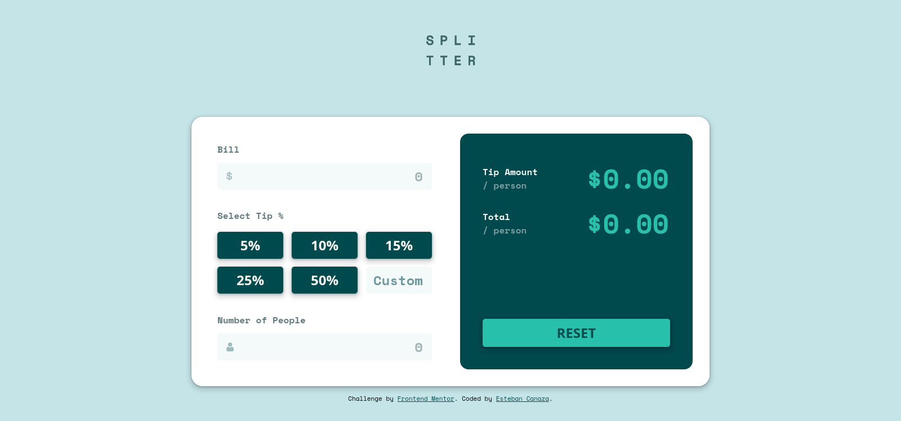

# Frontend Mentor - Tip calculator app solution

This is a solution to the [Tip calculator app challenge on Frontend Mentor](https://www.frontendmentor.io/challenges/tip-calculator-app-ugJNGbJUX). Frontend Mentor challenges help you improve your coding skills by building realistic projects.

## Built with

- HTML
- SASS
- Typescript
- eslint
- BEN methodology
- GIT

## Solution

[Tip calculator app challenge](https://stebanc.github.io/tip-calculator-app/dist/).

